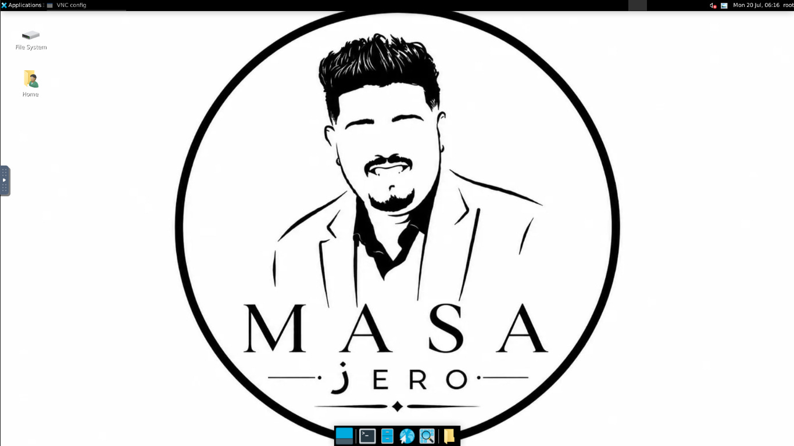

# Ubuntu Desktop via Web (Windows 10 Theme) 🖥️✨

This project is a Docker container built on **Ubuntu 22.04** running the XFCE desktop environment, which can be accessed directly from your web browser using **noVNC**.

This build has been heavily customized to look and feel like **Windows 10** with automated settings for a better user experience.

## 🌟 Features

* **Windows 10 Theme:** Automatically downloads and applies the B00merang Windows 10 theme and icon pack on startup.
* **Custom Wallpaper:** Configured to download a custom background image, overriding the default XFCE wallpapers.
* **Auto-Scaling Display:** The resolution is set to `1920x1080` but will automatically scale to perfectly fit your browser window without annoying scrollbars. Full-screen mode is also supported.
* **Browser Ready:** Comes pre-installed with Mozilla Firefox for immediate web browsing.
* **Railway Ready:** Configurations and files are perfectly structured for easy deployment on Railway's cloud infrastructure.

## 🚀 Deployment

1. Push these files (specifically the `Dockerfile` and `screenshot.jpg`) to your GitHub repository.
2. Link your GitHub repository to your **Railway** account.
3. Railway will automatically read the `Dockerfile` and build the environment.
4. Once completed, open the domain provided by Railway in your web browser.
5. You will be automatically redirected to the VNC page, and your Windows 10 styled desktop will be ready to use!

## 🛠️ Customization
* **Change Wallpaper:** Modify the image URL next to the `wget` command in the `Dockerfile`.
* **Change Resolution:** Find `1920x1080` in the `Dockerfile` and change it to your preferred resolution.

---
*This project is optimized to deliver the best performance with minimal resource consumption.*

## 🌐 Contact & Follow

  
  
  
  
  

